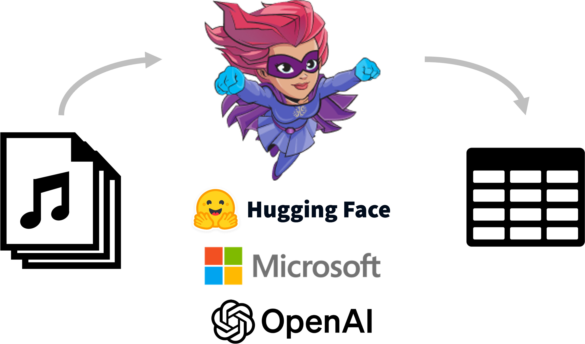

#  MLRun's Call Center Demo

This demo showcases how to use LLMs to turn audio files from call center conversations between customers and agents into valuable data, all in a single workflow orchestrated by MLRun.

MLRun automates the entire workflow, auto-scales resources as needed, and automatically logs and parses values between the different workflow steps.

By the end of this demo you will see the potential power of LLMs for feature extraction, and how easily you can do this with MLRun!

This demo uses:
* [**OpenAI's Whisper**](https://openai.com/research/whisper) &mdash; To transcribe the audio calls into text.
* [**Flair**](https://flairnlp.github.io/) and [**Microsoft's Presidio**](https://microsoft.github.io/presidio/) - To recognize PII so it can be filtered out.
* [**HuggingFace**](https://huggingface.co/) &mdash; The main machine-learning framework to get the model and tokenizer for the features extraction. 
* and [**MLRun**](https://www.mlrun.org/) &mdash; as the orchestrator to operationalize the workflow.

The demo contains a single [notebook](./notebook.ipynb) that encompasses the entire demo.

Most of the functions are imported from [MLRun's function hub](https://docs.mlrun.org/en/stable/runtimes/load-from-hub.html), which contains a wide range of functions that can be used for a variety of use cases. All functions used in the demo include links to their source in the hub. All of the python source code is under [/src](./src).
Enjoy!

___

## Installation

This project can run in different development environments:
* Local computer (using PyCharm, VSCode, Jupyter, etc.)
* Inside GitHub Codespaces 
* Other managed Jupyter environments

### Install the code and the mlrun client 

To get started, fork this repo into your GitHub account and clone it into your development environment.

To install the package dependencies (not required in GitHub codespaces) use:
 
    make install-requirements
    
If you prefer to use Conda, use this instead (to create and configure a conda env):

    make conda-env

> Make sure you open the notebooks and select the `mlrun` conda environment 
 
### Install or connect to the MLRun service/cluster

The MLRun service and computation can run locally (minimal setup) or over a remote Kubernetes environment.

If your development environment supports Docker and there are sufficient CPU resources, run:

    make mlrun-docker
    
> MLRun UI can be viewed in: http://localhost:8060
    
If your environment is minimal, run mlrun as a process (no UI):

    [conda activate mlrun &&] make mlrun-api
 
For MLRun to run properly you should set your client environment. This is not required when using **codespaces**, the mlrun **conda** environment, or **iguazio** managed notebooks.

Your environment should include `MLRUN_ENV_FILE=<absolute path to the ./mlrun.env file> ` (point to the mlrun .env file 
in this repo); see [mlrun client setup](https://docs.mlrun.org/en/latest/install/remote.html) instructions for details.  
     
> Note: You can also use a remote MLRun service (over Kubernetes): instead of starting a local mlrun: 
> edit the [mlrun.env](./mlrun.env) and specify its address and credentials.
